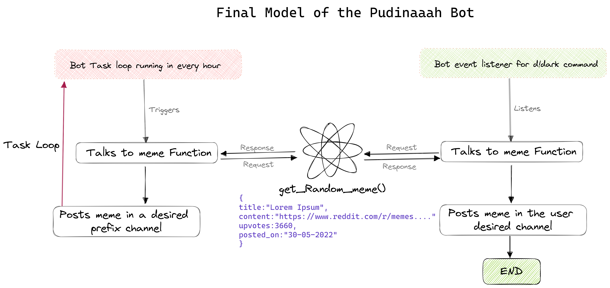
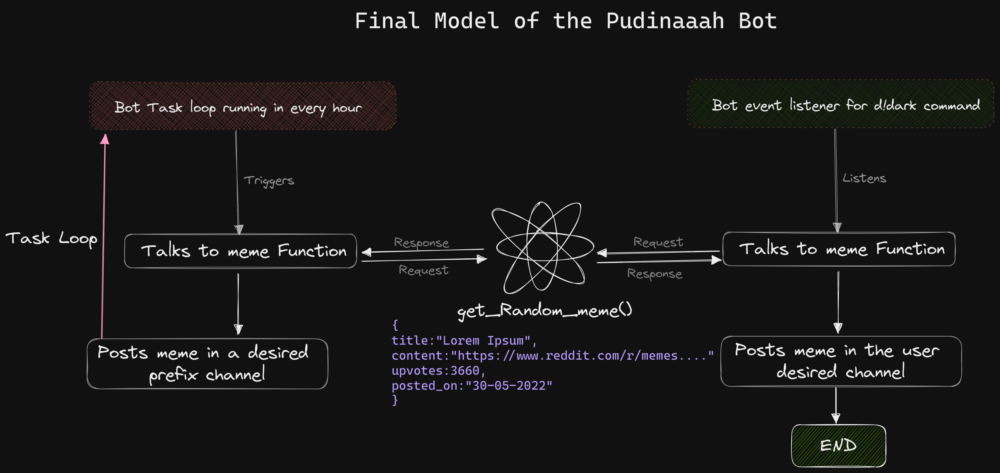

# Pudinaaah
Pudinaah, a Dark Memes discord bot developed for unknows purposes. 


`and for dark mode users : `



# About
Pudinaah is a discord bot that randomly sends a meme from the below mentioned subreddits mentioned in `constants.py`

```python
SUBREDDITS = [
    'FingMemes',
    'Offensivejokes',
    'DarkMemes_69'
]
```

Current prefix for the bot is `d!` and can be changed form `constants.py`

```python
EXT='d!'
```

To `load`/`unload`/`reload` the meme cog or to restart the bot, the bot admin should have the role 'Memer69' and can be changed from `constants.py`

```python
ADMIN_ROLE = "Memer69"
```

## TO-DOs
- [ ] Think about what to do next
- [ ] Let [Pawan](https://github.com/pawann-2000) make a function to return dict object from posts.json scrapped by the spider
- [ ] Prepare the meme command
- [ ] A loop discord task to post a random meme every hour

## References / Credits

> `https://gist.github.com/jagrosh/5b1761213e33fc5b54ec7f6379034a22` - How to [send webhook notification about a repository to Discord](https://gist.github.com/jagrosh/5b1761213e33fc5b54ec7f6379034a22)

> `https://medium.com/analytics-vidhya/scraping-reddit-with-scrapy-ea2d30ad3234` - [Scraping reddit with Scrapy.](https://medium.com/analytics-vidhya/scraping-reddit-with-scrapy-ea2d30ad3234)